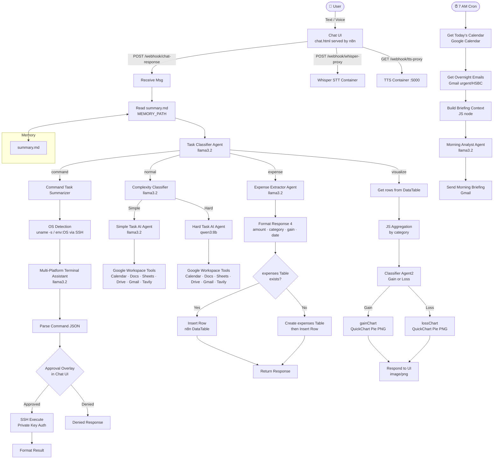

# 🧠 AI Personal Operations Center (POC) - "The Second Brain"

## 📖 Project Overview
A local-first, privacy-focused agentic AI assistant built on **n8n**, **Ollama**, and **Docker**.
It handles intelligent chat, secure SSH terminal execution, expense tracking with built-in charting,
Google Workspace integration, and automated morning briefings — all running on your own machine.

***

## 🏗 System Architecture

The following diagram illustrates the flow of data between the User, the Supervisor Agent, and the main tools, all inside your own UI and terminal environment.



***

## 🛠 Tech Stack

| Component               | Technology                                                       | Docker Image                            |
| ----------------------- | ---------------------------------------------------------------- | --------------------------------------- |
| Orchestration           | n8n                                                              | n8nio/n8n                               |
| LLM (Simple/Classifier) | Ollama — llama3.2:latest                                         | ollama/ollama                           |
| LLM (Hard tasks)        | Ollama — qwen3:8b                                                | ollama/ollama                           |
| Chat UI                 | chat.html (inline in n8n webhook, vanilla JS)                    | /                                       |
| Containerization        | Docker + Docker Compose                                          | /                                       |
| Public Tunnel           | ngrok                                                            | ngrok/ngrok                             |
| Speech-to-Text          | Whisper (self-hosted container)                                  | onerahmet/openai-whisper-asr-webservice |
| Text-to-Speech          | TTS (self-hosted container on port 5000)                         | synesthesiam/wyoming-piper              |
| Integrations            | Gmail, Google Calendar, Google Docs, Google Sheets, Google Drive | /                                       |
| Web Search              | Tavily                                                           | /                                       |
| SSH Execution           | OpenSSH (private key auth, Windows/macOS/Linux)                  | /                                       |
| Memory                  | summary.md file via $env.MEMORY_PATH                             | /                                       |
| Expense DB              | n8n built-in DataTable (table name: expenses)                    | /                                       |
| Chart Generation        | n8n built-in QuickChart node (pie charts, PNG output)            | /                                       |

***

## 🚀 Core Features & Workflows

### 🔧 Tools Available to Agents
- **Gmail** — read messages, send emails
- **Google Calendar** — create events, list events
- **Google Docs** — get / update documents
- **Google Sheets** — get rows, append/update rows, create sheets
- **Google Drive** — search files and folders
- **Tavily** — web search
- **SSH Terminal** — execute shell commands on host machine (dedicated pipeline)
- **n8n DataTable** — read / write expenses database
- **n8n QuickChart** — generate pie charts (PNG)

### 1. 🎙️ Telegram Voice Interface ("Walk & Talk")
**Goal:** Hands-free interaction while walking via Telegram.
- **Input:** User sends Voice Note via **Telegram** (not yet connected; currently browser-only)
- **Transcribe:** n8n Webhook receives audio → Whisper Container
- **Think:** Transcript returned to Chat UI → auto-sent to `/webhook/chat-response` → **Task Classifier Agent** → Ollama (llama3.2 / qwen3:8b)
- **Speak:** LLM response → **Kokoro TTS** → Audio file
- **Output:** n8n sends audio file back to Telegram as a reply

### 2. 👮 Supervisor & Sub-Agents Pattern
**Goal:** Break down complex tasks into atomic actions.
- **Supervisor Agent:** Task Classifier Agent (llama3.2) analyzes intent and routes to specific workers
  - **Worker A (Command):** Multi-Platform Terminal Assistant — executes shell commands via SSH
  - **Worker B (Simple Task):** Simple Task AI Agent (llama3.2) — handles factual lookups and lightweight tasks
  - **Worker C (Hard Task):** Hard Task AI Agent (qwen3:8b) — handles reasoning, multi-step logic, and coding
  - **Worker D (Expense):** Expense Extractor AI Agent (llama3.2) — parses and logs expense transactions
  - **Worker E (Visualize):** QuickChart pipeline — aggregates DataTable and renders pie charts

### 3. 🔒 Secure SSH & Human-in-the-Loop
**Goal:** Execute terminal commands safely with user approval.
- **Draft:** Command Task Summarizer (llama3.2) rewrites user intent into a plain English task → Multi-Platform Terminal Assistant (llama3.2) generates the correct shell command per OS (Windows/macOS/Linux)
- **Risk Assessment:** Command is classified as 🟢 low / 🟡 medium / 🔴 high with a reason
- **Human Gate:** Chat UI shows an Approval Overlay with command, description, and risk — user clicks **[Approve] / [Deny]**
- **Execution:** SSH node runs command via private key only upon explicit approval
- **OS Detection:** Runs `uname -s` (macOS/Linux) and `$env:OS` (Windows) in parallel to detect host OS

### 4. 🧠 Long-Term Memory
**Goal:** Continuity across sessions.
- **Session Start:** Workflow reads `summary.md` (user profile) via `$env.MEMORY_PATH` before processing every query
- **On Every Message:** Memory Updater (llama3.2) rewrites and saves an updated `summary.md` in parallel with the agent response — not at session end
- Profile stores projects, preferences, schedule context, and study interests

### 5. 💰 Expense Tracker
**Goal:** Frictionless expense logging with visual insights.
- **Input:** User texts naturally, e.g. *"Spent $50 on lunch"*
- **Extraction:** Expense Extractor Agent parses `{"amount": 50, "category": "Food", "date": "...", "gain": false}`
- **Storage:** Appended to **n8n's built-in DataTable** (`expenses` table); auto-created if absent
- **Visualization:**
  - **Trigger:** User asks *"Show my spending chart"*
  - **Action:** Reads all rows from DataTable → JS node aggregates totals by category → Classifier Agent2 picks Gain or Loss
  - **Output:** **n8n QuickChart node** generates a pie chart (PNG) returned directly to Chat UI

### 6. 🌅 Morning Analyst Briefing
**Goal:** Executive summary delivered at 7:00 AM.
- **Trigger:** Cron schedule — every day at 7:00 AM
- **Data Sources:**
  - **Calendar:** Fetches today's events from Google Calendar
  - **Gmail:** Filters for `urgent` or `@hsbc.com` emails received overnight (last 12 hours)
- **Synthesis:** Morning Analyst Agent (llama3.2) generates a structured briefing with: Markets, Today's Schedule, Overnight Emails, Action Items Before Noon
- **Output:** Briefing delivered via Gmail to configured address

***

## 📁 Key Files

| File | Purpose |
|:---|:---|
| `Main Workflow.json` | Full n8n workflow (all nodes + connections) |
| `brian/memory/summary.md` | Persistent user profile / memory file |
| `brian/n8n/SSH setup.md` | SSH configuration guide |
| `docker-compose.yml` | Container orchestration |
| `Windows_Chat.bat` | Windows launcher for Chat UI |
| `MAC_Chat.command` | macOS launcher for Chat UI |

## 📂 Folder Structure

```text
comp3520-AI-Assistant/
├── .devcontainer/
│   └── devcontainer.json        # VS Code Dev Container configuration
├── brian/
│   ├── memory/
│   │   ├── history.jsonl        # Persistent conversation history log
│   │   ├── summary.md           # Active user profile / long-term memory
│   │   └── summary.md.backup    # Backup of previous memory state
│   └── n8n/
│       ├── .n8n/
│       │   ├── config           # n8n instance configuration
│       │   ├── database.sqlite  # n8n workflow & credential database
│       │   └── n8nEventLog*.log # n8n runtime event logs
│       ├── .env                 # Environment variables (API keys, paths)
│       ├── chat.html            # Main Chat UI (vanilla JS, served via n8n webhook)
│       ├── chat_noVM.html       # Old version Chat UI (no voice mode)
│       ├── docker-compose.yml   # Docker stack (n8n, Ollama, Whisper, TTS, ngrok)
│       ├── ngrok.yml            # ngrok tunnel configuration
│       ├── requirements.txt     # Python dependencies
│       ├── start_ngrok.sh       # Shell script to launch ngrok tunnel
│       └── streamlit_app.py     # Streamlit UI alternative
├── Main Workflow.json           # Full exported n8n workflow
├── DEPLOYMENT_GUIDE.md          # Step-by-step deployment instructions
├── MAC_Chat.command             # macOS one-click launcher for Chat UI
├── SSH setup.md         # SSH key configuration guide
└── Windows_Chat.bat             # Windows one-click launcher for Chat UI
```

***

## 🗓 Implementation Roadmap

### Phase 1: Foundation (Days 1-2)
- [ ] Set up `docker-compose.yml` with Ollama, n8n, and PostgreSQL.
- [ ] Connect Telegram Bot API to n8n Webhook.
- [ ] Verify Ollama is running `llama3.2` locally.

### Phase 2: The Brain & Tools (Days 3-5)
- [ ] Build the **Supervisor Agent** node in n8n.
- [ ] Integrate **Google Workspace** (Gmail/Calendar/Sheets) credentials.
- [ ] Implement **SSH Tool** with the "Human-in-the-Loop" Telegram button.

### Phase 3: Voice & Multimedia (Days 6-7)
- [ ] Deploy **Whisper** and **TTS** containers.
- [ ] Create the Audio processing workflow (Audio $\to$ Text $\to$ AI $\to$ Audio).

### Phase 4: Memory & Analysis (Days 8-10)
- [ ] Set up the **Expense Database** and Python Chart generation script.
- [ ] Implement the **"Read Summary.md"** logic at start of chat.
- [ ] Configure **LangFuse** for observability.

***

## 🗓 Workload Partitioning (3-Part Split)

To ensure manageable development, the project is divided into three equal workload sprints.

### Part 1: Core Infrastructure & Basic Orchestration
**Focus:** Setting up the "Body" (Docker/n8n) and "Brain" (Ollama) to establish basic communication.
*   [x] **Infrastructure:** Configure `docker-compose.yml` with **n8n** and **Ollama** (models: `llama3.2`, `qwen3:8b`).
*   [x] **Interface:** Design the UI interface for the project (vanilla JavaScript Chat UI served via n8n webhook).
*   [x] **Orchestration:** Build the foundational **Task Classifier Agent** node in n8n to route `command` / `normal` / `expense` / `visualize` intents via `Agent Switch Task`.
*   [x] **Dual LLM:** Simple tasks use `llama3.2`, hard/reasoning tasks route to `qwen3:8b` via a **Complexity Classifier** agent.

### Part 2: Tools, Security & Analytics
**Focus:** Giving the agent "Hands" (SSH/Tools) and "Eyes" (Google/Data) to perform work.
*   [x] **Integrations:** Configure **Google Cloud Console** credentials for Gmail, Calendar, Sheets, Docs, and Drive access (all connected as AI tools to both Simple and Hard Task agents).
*   [x] **Secure Ops:** Implement the **SSH Tool** with the "Human-in-the-Loop" approval flow (Draft → Approve → Execute), with multi-OS support (Windows / macOS / Linux) and 🟢/🟡/🔴 risk classification.
*   [x] **Approval Overlay UI:** In-browser Human-in-the-Loop approval dialog with command preview, risk badge, Approve/Deny buttons — no Telegram dependency.
*   [x] **OS Detection:** Parallel SSH probes (`uname -s` for macOS/Linux, `$env:OS` for Windows) to auto-detect host before generating shell commands.
*   [x] **Data Analysis:** Set up the **Expense Database** (n8n DataTable) and chart generation via **QuickChart** (separate gain/loss pie charts, PNG output).
*   [x] **Workflow:** Create the **"Morning Analyst"** automation — 7 AM cron → Google Calendar + Gmail (urgent/HSBC) → `llama3.2` briefing → sent via Gmail.
*   [x] **Web Search:** Integrate **Tavily** search tool available to both Simple and Hard Task agents.

### Part 3: Voice, Memory & Advanced Synthesis
**Focus:** Adding the "Ears/Voice" (Multimedia) and "Soul" (Long-term Context).
*   [x] **Multimedia Stack:** Deploy **Whisper** (STT at `whisper:9000`) and **TTS** (Piper at `tts:5000`) containers to the Docker stack.
*   [x] **Voice Pipeline:** Build the n8n workflow for **Audio Note → Transcript → LLM → Audio Reply** (mic button in Chat UI → Whisper proxy → auto-send → TTS playback).
*   [x] **Whisper Proxy & TTS Proxy:** Dedicated n8n webhook routes (`/whisper-proxy`, `/tts-proxy`) proxy browser requests to internal Docker containers with CORS headers.
*   [x] **Context Injection:** Read `summary.md` and inject user preferences into every new session via the **Extract from File** node feeding into agents.
*   [x] **Memory Auto-Update:** `Memory Updater` (llama3.2) rewrites and saves `summary.md` in parallel on every message — not just at session end.
*   [x] **Expense Gain/Loss Split:** `Classifier Agent2` routes visualize requests to separate **gainChart** vs **lossChart** QuickChart pie renders.

***

## 🚦 Getting Started

This project runs as a Docker-based stack with n8n (workflow automation), Ollama (local LLM), Whisper (speech-to-text), and Coqui TTS (text-to-speech).

```markdown
### Prerequisites

- Docker & Docker Compose installed  
  → https://docs.docker.com/get-docker/
- Git
- (Optional but recommended for Google OAuth public redirect)  
  → ngrok account (free tier works)

### Step 1: Clone the Repository

```bash
git clone https://github.com/COMP3520/comp3520-AI-Assistant.git
cd comp3520-AI-Assistant
```

### Step 2: Prepare Environment Variables (.env)

**Important – Google Credentials setup**  
1. Go to https://console.cloud.google.com/apis/credentials
2. Create OAuth 2.0 Client ID → Web application
3. Add authorized redirect URI:
   - `http://localhost:5678/rest/oauth2-credential/callback` (local)
   - Later: `https://your-ngrok-url/rest/oauth2-credential/callback`
4. Copy **Client ID** and **Client Secret** → configure in n8n Credentials tab
5. Enable APIs: Gmail API, Google Calendar API, Google Sheets API, Google Docs API, Google Drive API

### Step 3: Start the Docker Stack

```bash
docker compose up -d
```

Wait ~1–2 minutes for services to be healthy.

Check running containers:
```bash
docker compose ps
```

This will start:
- **n8n** on port `5678`
- **PostgreSQL** on port `5432` (n8n's backend database, internal only)
- **Ollama** (LLM backend) on port `11434`
- **Whisper** (STT) accessible on port `8000` (maps to internal port 9000)
- **Coqui TTS** accessible on port `5010` (maps to internal port 5000)

### Step 4: Initialize Ollama Model (once)

```bash
# Pull both models used by the agent
docker exec -it ollama ollama pull llama3.2
docker exec -it ollama ollama pull qwen3:8b
```

- `llama3.2` — used for simple tasks, memory updates, and the Morning Briefing
- `qwen3:8b` — used for complex reasoning tasks

### Step 5: Configure n8n (Core Workflows + Credentials)

1. Open n8n UI → http://localhost:5678  
   Create an account and login.

2. **Set up credentials** (n8n → Credentials tab):
   - **Ollama** → point to internal Docker host
   - **Google OAuth2** → use Client ID/Secret from Step 2  
     → n8n will guide you through Google sign-in & consent  
     → covers Gmail, Calendar, Docs, Sheets, Drive
   - **Tavily** → API key from https://tavily.com
   - **SSH Private Key/ Password** → your host machine's private key (for SSH tool). If you use private key, please refer to the SSH setup.md for more detail.


3. **Import workflows**  
   - Go to Workflows → Import from File
   - Import `Main Workflow.json` from the repository root
   - Activate the workflow

4. **Access the Chat UI**
   - Open http://localhost:5678/webhook/chat in your browser
   - You should see the dark-themed chat interface with mic button

### Step 6: Expose Services Publicly with ngrok (Telegram webhook, testing, etc.)

Many features (Telegram bot webhook, Google OAuth redirect) require a public HTTPS URL.

1. **Sign up** (free) → https://ngrok.com  
2. **Download & install ngrok**  
   - https://ngrok.com/download  
   - Unzip and move to a folder in your PATH (or run from Downloads)

3. Authenticate (only once):
   ```bash
   ngrok config add-authtoken YOUR_AUTH_TOKEN_HERE
   ```

4. Expose n8n (port 5678):
   ```bash
   ngrok http 5678
   ```

   → You'll get a URL like `https://abcd-1234.ngrok-free.app`

5. **Update Google OAuth redirect URI** (in Google Console):  
   Add `https://abcd-1234.ngrok-free.app/rest/oauth2-credential/callback`

6. **Update Telegram webhook** (in n8n Telegram node or via API):  
   Set webhook to `https://abcd-1234.ngrok-free.app/webhook/xxx`

7. (Optional) Expose Streamlit too:
   ```bash
   ngrok http 8501   # or whatever port Streamlit uses
   ```

**Tip**: Use ngrok paid plan or custom domain for static URLs (free URLs change on restart).

### Step 7: Access Streamlit UI

Once running:

- Local: http://localhost:8501 (or the port defined in docker-compose for Streamlit service)  
- Via ngrok: the https URL from ngrok http 8501

You should see the chat interface / dashboard for interacting with the AI assistant.

### Troubleshooting

- **n8n not starting?** → `docker compose logs n8n`
- **Whisper not responding?** → `docker compose logs whisper` — accessible on port `8000`
- **TTS silent?** → `docker compose logs tts` (Coqui TTS) — accessible on port `5010`
- **Ollama models missing?** → `docker exec -it ollama ollama list` — confirm both `llama3.2` and `qwen3:8b` are pulled
- **Google OAuth fails?** → Double-check redirect URI matches exactly
- **Memory not persisting?** → Ensure `brian/memory/summary.md` exists at your project root (mounted via `./../../`)
- **Ports conflict?** → Adjust port mappings in `docker-compose.yml`

Enjoy your local-first AI Personal Operations Center! 🚀
```

Feel free to adjust port numbers, folder names (`n8n_workflows/`), or service names according to your actual `docker-compose.yml`. If your repo has different structure (e.g. no Streamlit service yet), you can add a note like:

> Streamlit is currently under development — you can run it manually via `streamlit run brian/streamlit.py` after installing requirements.

Let me know if you want to add screenshots, architecture diagram section, or more advanced options (e.g. Caddy reverse proxy instead of ngrok).
