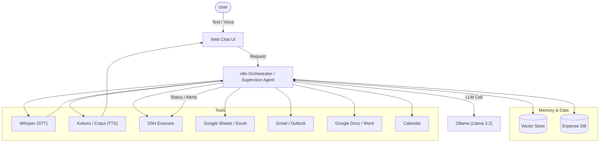

Here is a comprehensive Project Plan in `README.md` format, incorporating all your specified features, tools, and workflows.

***

# 🧠 AI Personal Operations Center (POC) - "The Second Brain"

## 📖 Overview
This project represents a local-first, privacy-focused **Agentic Operations Center**. It acts as an autonomous assistant capable of handling complex multimodal inputs (Voice, Text), executing secure system operations (SSH), managing personal finance, and proactively organizing daily life through a "Supervisor" agent architecture.

The system is fully containerized using **Docker**, orchestrating **Ollama** (Local LLM), **n8n** (Workflow Automation), and various tool integrations into a unified, observable ecosystem.

***

## 🏗 System Architecture

The following diagram illustrates the flow of data between the User, the Supervisor Agent, and the main tools, all inside your own UI and terminal environment.




***

## 🛠 Tech Stack

| Component | Technology | Docker Image |
| :--- | :--- | :--- |
| **Orchestration** | n8n | `n8nio/n8n:latest` |
| **LLM Backend** | Ollama (Llama 3.2) | `ollama/ollama:latest` |
| **Speech-to-Text** | Whisper (Local) | `openai/whisper` (or `faster-whisper-server`) |
| **Text-to-Speech** | Kokoro / Coqui TTS | `ghcr.io/coqui-ai/tts` |
| **Database** | PostgreSQL / Vector Store | `postgres:16` / `chromadb` |
| **Code Sandbox** | Python Container | `python:3.11-slim` (with Pandas, Matplotlib) |
| **Frontend UI** | Streamlit / Open WebUI | `streamlit` or `open-webui` |
| **Observability** | LangFuse | `langfuse/langfuse` |

***

## 🚀 Core Features & Workflows

Tools:

- google sheet/ excel 
- SSH excute terminal
- Gmail/ outlook
- Whatsapp/ telegram 
- Word/ google doc
- Calendar

### 1. 🎙️ Multimodal Voice Interface ("Walk & Talk")
**Goal:** Hands-free interaction while walking.
*   **Workflow:**
    1.  **Input:** User sends Voice Note via Telegram.
    2.  **Transcribe:** n8n Webhook receives audio $\to$ sends to **Whisper Container**.
    3.  **Think:** Transcribed text $\to$ **Ollama** (Llama 3.2) for processing.
    4.  **Speak:** LLM response $\to$ **Kokoro TTS** $\to$ Audio File.
    5.  **Output:** n8n sends Audio File back to Telegram as a reply.

### 2. 👮 Supervisor & Sub-Agents Pattern
**Goal:** Break down complex tasks into atomic actions.
*   **Supervisor Agent:** Analyzes intent and routes to specific workers.
    *   **Worker A (Search):** RAG search over emails/docs.
    *   **Worker B (Analyst):** Uses "Code Interpreter" to analyze data.
    *   **Worker C (Writer):** Formats final output (PDF/Markdown).

### 3. 🛡️ Secure SSH & Human-in-the-Loop
**Goal:** Execute terminal commands safely without accidental destruction.
*   **Security Layer:**
    1.  **Draft:** Agent proposes `rm -rf /logs`.
    2.  **Critic Audit:** A separate "Critic" model prompt: *"User wants to run `rm -rf /logs`. Is this safe? Respond YES/NO."*
    3.  **Human Gate:** If Critic is unsure or command is high-risk $\to$ Send Telegram Button: **[Approve] / [Deny]**.
    4.  **Execution:** Only runs upon explicit click.

### 4. 🧠 Long-Term Memory (Context Preservation)
**Goal:** Continuity across sessions.
*   **Session Start:** Workflow reads `Summary.md` (high-level user profile) before processing the first query.
*   **Session End (Batch):** Every 10 turns, a background job summarizes the interaction and updates `user_profiles` in the Vector Store.
*   **Recall:** Uses semantic search to retrieve "User preferences for Python projects" when relevant.

### 5. 💰 Expenditure Tracking & Visualization
**Goal:** Frictionless expense logging with visual insights.
*   **Input:** User texts: *"Spent $50 on lunch."*
*   **Extraction:** Agent extracts `{"amount": 50, "category": "Food", "date": "2025-01-27"}`.
*   **Storage:** Appends to SQL Database or Google Sheet.
*   **Visualization:**
    *   **Trigger:** User asks *"Show my monthly spending."*
    *   **Action:** Python Sandbox queries DB $\to$ Generates Pie Chart (`matplotlib`) $\to$ Saves image.
    *   **Output:** Image sent to Chat UI / Telegram.

### 6. 🌅 "Morning Analyst" Briefing
**Goal:** Executive summary delivered at 7:00 AM.
*   **Trigger:** Cron Schedule (07:00).
*   **Data Sources:**
    *   **Calendar:** Fetch today's events.
    *   **Gmail:** Filter for "Urgent" or domain `*@hsbc.com` received overnight.
    *   **Markets:** Python script calls `yfinance` (S&P 500 close, HKD/USD).
*   **Synthesis:** Agent generates a structured briefing with "Action Items".

***

## 📂 Folder Structure

```text
/ai-poc-project
├── docker-compose.yml       # Orchestrates n8n, ollama, whisper, db
├── .env                     # API Keys (Telegram, Google, OpenAI if needed)
├── /n8n_workflows           # JSON exports of n8n flows
│   ├── supervisor_agent.json
│   ├── voice_pipeline.json
│   └── morning_briefing.json
├── /python_sandbox          # Scripts for code interpreter
│   ├── market_data.py
│   └── generate_chart.py
├── /memory                  # Local storage for context
│   ├── summary.md
│   └── vector_store/
└── /data                    # Persistent volume data
```

***

## 🗓 Implementation Roadmap

### Phase 1: Foundation (Days 1-2)
- [ ] Set up `docker-compose.yml` with Ollama, n8n, and PostgreSQL.
- [ ] Connect Telegram Bot API to n8n Webhook.
- [ ] Verify Ollama is running `llama3.2` locally.

### Phase 2: The Brain & Tools (Days 3-5)
- [ ] Build the **Supervisor Agent** node in n8n.
- [ ] Integrate **Google Workspace** (Gmail/Calendar/Sheets) credentials.
- [ ] Implement **SSH Tool** with the "Human-in-the-Loop" Telegram button.

### Phase 3: Voice & Multimedia (Days 6-7)
- [ ] Deploy **Whisper** and **TTS** containers.
- [ ] Create the Audio processing workflow (Audio $\to$ Text $\to$ AI $\to$ Audio).

### Phase 4: Memory & Analysis (Days 8-10)
- [ ] Set up the **Expense Database** and Python Chart generation script.
- [ ] Implement the **"Read Summary.md"** logic at start of chat.
- [ ] Configure **LangFuse** for observability.

***

## 🗓 Workload Partitioning (3-Part Split)

To ensure manageable development, the project is divided into three equal workload sprints.

### Part 1: Core Infrastructure & Basic Orchestration
**Focus:** Setting up the "Body" (Docker/n8n) and "Brain" (Ollama) to establish basic communication.
*   [ ] **Infrastructure:** Configure `docker-compose.yml` with **n8n**, **Ollama** (pull `llama3.2`), **PostgreSQL**, and **LangFuse**.
*   [ ] **Interface:** Connect **Telegram Bot API** to n8n Webhook for text-based chat.
*   [ ] **Orchestration:** Build the foundational **Supervisor Agent** node in n8n to route basic "Chat" vs. "Task" intents.
*   [ ] **Observability:** Initialize **LangFuse** to trace LLM thoughts and debug the initial agent logic.
*   [ ] **Interface:** Make up and design the UI interface for the project ( streamlit/ Javascript) 

### Part 2: Tools, Security & Analytics
**Focus:** Giving the agent "Hands" (SSH/Tools) and "Eyes" (Google/Data) to perform work.
*   [ ] **Integrations:** Configure **Google Cloud Console** credentials for Gmail, Calendar, and Sheets access.
*   [ ] **Secure Ops:** Implement the **SSH Tool** with the "Human-in-the-Loop" Telegram button flow (Draft $\to$ Approve $\to$ Execute).
*   [ ] **Data Analysis:** Set up the **Python Sandbox** container and write the script for generating **Expense Charts** (`matplotlib`).
*   [ ] **Workflow:** Create the **"Morning Analyst"** automation to aggregate Calendar and Gmail data into a daily text summary.

### Part 3: Voice, Memory & Advanced Synthesis
**Focus:** Adding the "Ears/Voice" (Multimedia) and "Soul" (Long-term Context).
*   [ ] **Multimedia Stack:** Deploy **Whisper** (STT) and **Kokoro/Coqui** (TTS) containers to the Docker stack.
*   [ ] **Voice Pipeline:** Build the n8n workflow for **Audio Note $\to$ Transcript $\to$ LLM $\to$ Audio Reply**.
*   [ ] **Long-Term Memory:** Implement the **Vector Store** (ChromaDB/Pgvector) logic to read/write user facts.
*   [ ] **Context Injection:** Create the pre-prompt logic to read `summary.md` and inject user preferences into every new session.

***

## 🚦 Getting Started

Here’s a well-structured **README setup section** you can add (or replace) in your project's README.md. It focuses on a clear, step-by-step guide covering:

- Docker setup (assuming `docker-compose.yml` exists in the repo)
- n8n credentials configuration (including Google OAuth)
- ngrok setup (for exposing n8n/Streamlit/Telegram webhooks publicly)
- Streamlit access & run

```markdown
## Quick Start – Local Development Setup

This project runs as a Docker-based stack with n8n (workflow automation), Ollama (local LLM), Streamlit (UI), and optional public exposure via ngrok.

### Prerequisites

- Docker & Docker Compose installed  
  → https://docs.docker.com/get-docker/
- Git
- (Optional but recommended for public access / Telegram bot)  
  → ngrok account (free tier works)

### Step 1: Clone the Repository

```bash
git clone https://github.com/COMP3520/comp3520-AI-Assistant.git
cd comp3520-AI-Assistant
```

### Step 2: Prepare Environment Variables (.env)


**Important – Google Credentials setup**  
1. Go to https://console.cloud.google.com/apis/credentials  
2. Create OAuth 2.0 Client ID → Web application  
3. Add authorized redirect URIs:  
   - `http://localhost:5678/rest/oauth2-credential/callback` (local)  
   - Later: your-ngrok-URL/rest/oauth2-credential/callback  
4. Copy **Client ID** and **Client Secret** → paste into `.env`  
5. Enable APIs: Gmail API, Google Calendar API, Google Sheets API, Google Drive API (depending on your workflows)

### Step 3: Start the Docker Stack

```bash
docker compose up -d
```

Wait ~1–2 minutes for services to be healthy.

Check running containers:
```bash
docker compose ps
```

### Step 4: Initialize Ollama Model (once)

```bash
docker exec -it ollama ollama pull llama3.2   # or llama3.2:3b if you want smaller
# or run interactively:
docker exec -it ollama ollama run llama3.2
```

### Step 5: Configure n8n (Core Workflows + Credentials)

1. Open n8n UI → http://localhost:5678  
   Login with credentials from `.env` (admin / your-password)

2. **Set up credentials** (in n8n → Credentials tab):  
   - Telegram → Bot token from `.env`  
   - Google → OAuth2 → use the Client ID/Secret from `.env`  
     → n8n will guide you through Google sign-in & consent  
   - (Optional) OpenAI / other services if used

3. **Import workflows**  
   - Go to Workflows → ... → Import from File/URL  
   - Import files from `n8n_workflows/` folder (e.g. `supervisor_agent.json`, `voice_pipeline.json`, `morning_briefing.json`)  
   - Activate them

4. Test a simple workflow (e.g. Telegram trigger → LLM → reply)

### Step 6: Expose Services Publicly with ngrok (Telegram webhook, testing, etc.)

Many features (Telegram bot webhook, Google OAuth redirect) require a public HTTPS URL.

1. **Sign up** (free) → https://ngrok.com  
2. **Download & install ngrok**  
   - https://ngrok.com/download  
   - Unzip and move to a folder in your PATH (or run from Downloads)

3. Authenticate (only once):
   ```bash
   ./ngrok authtoken YOUR_AUTH_TOKEN_HERE
   ```

4. Expose n8n (port 5678):
   ```bash
   ngrok http 5678
   ```

   → You'll get a URL like `https://abcd-1234.ngrok-free.app`

5. **Update Google OAuth redirect URI** (in Google Console):  
   Add `https://abcd-1234.ngrok-free.app/rest/oauth2-credential/callback`

6. **Update Telegram webhook** (in n8n Telegram node or via API):  
   Set webhook to `https://abcd-1234.ngrok-free.app/webhook/xxx`

7. (Optional) Expose Streamlit too:
   ```bash
   ngrok http 8501   # or whatever port Streamlit uses
   ```

**Tip**: Use ngrok paid plan or custom domain for static URLs (free URLs change on restart).

### Step 7: Access Streamlit UI

Once running:

- Local: http://localhost:8501 (or the port defined in docker-compose for Streamlit service)  
- Via ngrok: the https URL from ngrok http 8501

You should see the chat interface / dashboard for interacting with the AI assistant.

### Troubleshooting

- n8n not starting? Check logs: `docker compose logs n8n`  
- Google OAuth fails? Double-check redirect URI matches exactly  
- Ollama slow? Make sure you pulled the model  
- Ports conflict? Change them in `docker-compose.yml`

Enjoy your local-first AI Personal Operations Center! 🚀
```

Feel free to adjust port numbers, folder names (`n8n_workflows/`), or service names according to your actual `docker-compose.yml`. If your repo has different structure (e.g. no Streamlit service yet), you can add a note like:

> Streamlit is currently under development — you can run it manually via `streamlit run brian/streamlit.py` after installing requirements.

Let me know if you want to add screenshots, architecture diagram section, or more advanced options (e.g. Caddy reverse proxy instead of ngrok).
